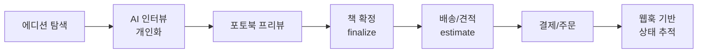
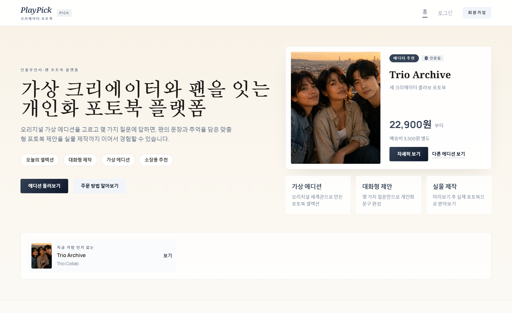
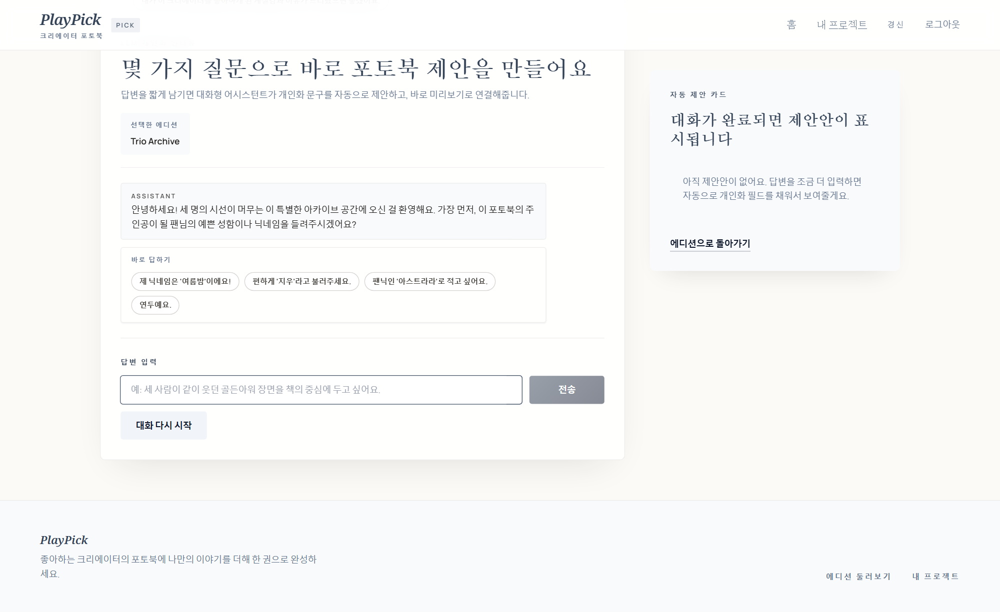
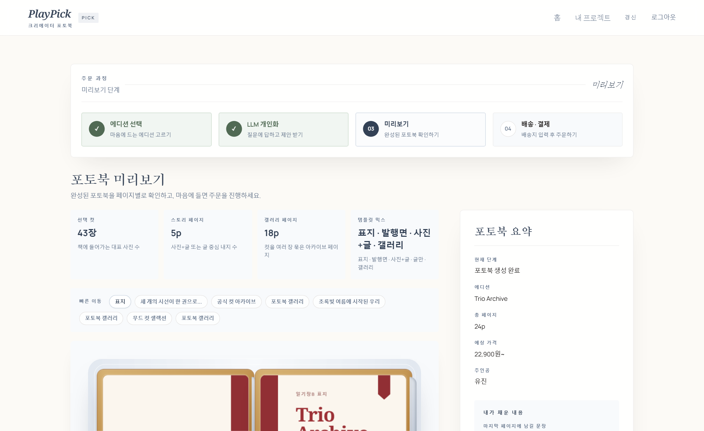
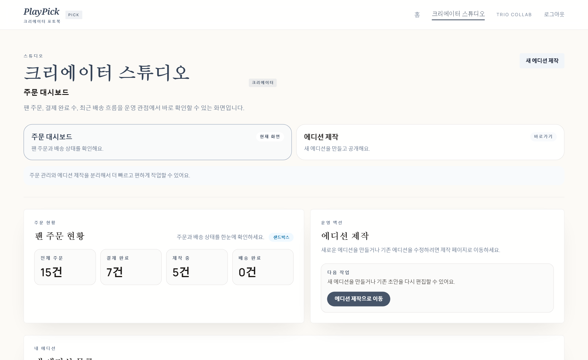
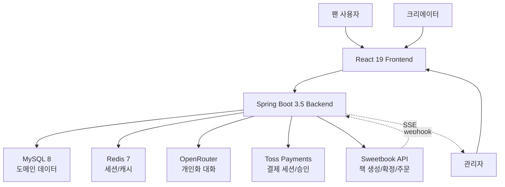

# PlayPick

> **공식 크리에이터 에디션 x 팬 개인화 x 실제 주문 가능한 포토북**
> Sweetbook Book Print API를 바탕으로 팬 경험, 크리에이터 스튜디오, 관리자 화면까지 연결해 본 풀스택 프로젝트

[](https://gscheon.com/sweetbook-demo/)


- **라이브 데모**: [https://gscheon.com/sweetbook-demo/](https://gscheon.com/sweetbook-demo/)
- **평가자 가이드**: [docs/portfolio/reviewer-guide.md](docs/portfolio/reviewer-guide.md)
- **케이스 스터디**: [docs/portfolio/playpick-case-study.md](docs/portfolio/playpick-case-study.md)
- **배포 가이드**: [deploy/README.md](deploy/README.md)

---

## 채용 포트폴리오 빠른 평가 가이드

처음 저장소를 열어보는 평가자가 짧은 시간 안에 확인할 수 있도록, 핵심 확인 지점을 먼저 정리했습니다.

| 보고 싶은 것 | 빠른 확인 위치 |
| --- | --- |
| 제품 문제 정의와 사용자 흐름 | [프로젝트 개요](#1-프로젝트-개요), [핵심 사용자 흐름](#2-핵심-사용자-흐름) |
| Sweetbook Books/Orders API 연동 방식 | [Sweetbook API 연동 범위](#7-sweetbook-api-연동-범위), `backend/src/main/java/com/playpick/infrastructure/sweetbook/SweetbookClient.java` |
| 보안/운영 고려 | 세션 인증, CSRF, Role 권한, HMAC 웹훅, 중복 이벤트 무해화, 관리자 SSE |
| 로컬 실행 가능성 | [데모와 로컬 실행](#9-데모와-로컬-실행), `.env.example`, `docker-compose.yml` |
| 더 깊은 설명 | [평가자 가이드](docs/portfolio/reviewer-guide.md), [케이스 스터디](docs/portfolio/playpick-case-study.md) |

### 5분 데모 동선

1. [라이브 데모](https://gscheon.com/sweetbook-demo/) 접속
2. 팬 계정으로 로그인: `fan@playpick.local` / `Fan12345!`
3. 에디션 선택 -> AI 인터뷰 -> 포토북 프리뷰 -> 배송/견적 -> 데모 주문 흐름 확인
4. 관리자 계정으로 전환: `admin@playpick.local` / `Admin12345!`
5. 주문, 정산, Sweetbook 웹훅 로그와 실시간 스트림 영역 확인

---

<details>
<summary><strong>Sweetbook API란? (클릭)</strong></summary>

이 프로젝트에서 말하는 **Sweetbook API**는 포토북을 실제로 제작하고 주문하기 위한 외부 인쇄 플랫폼 API입니다.

- **Books API**: 책 초안을 만들고, 표지/내지를 채우고, 최종 인쇄 가능 상태로 확정하는 영역
- **Orders API**: 제작비/배송비를 계산하고, 실제 주문을 생성하며, 이후 상태 변경을 웹훅으로 받는 영역

PlayPick은 이 API를 단순히 호출하는 데서 끝내지 않고, 그 위에 다음 제품 레이어를 얹었습니다.

1. 팬이 에디션을 고르고 AI 인터뷰로 개인화한다.
2. 개인화 결과를 실제 책 초안과 주문 흐름으로 연결한다.
3. 주문 이후 상태 변경을 웹훅으로 받아 관리자 화면에서 추적한다.

즉, PlayPick은 **Sweetbook API를 실제 사용자 흐름 안에서 어떻게 사용할지 고민하며 만든 프로젝트**라고 볼 수 있습니다.

</details>

---

## 한눈에 보기

| 항목 | 내용 |
| --- | --- |
| **프로젝트 성격** | 외부 인쇄 API(Sweetbook) 기반 포토북 커머스 프로젝트 |
| **사용자 역할** | 팬 / 크리에이터 / 관리자 3-role 구조 |
| **핵심 기술** | React 19, Spring Boot 3.5, Spring Security(Session + CSRF), MySQL, Redis, Toss Payments, HMAC Webhook, SSE |
| **중점 구현** | AI 채팅 인터뷰 기반 개인화, 웹훅 처리 흐름, 주문 시점 가격 스냅샷 |
| **데모 접근성** | 외부 API 키 없이도 전체 흐름 시연 가능하도록 시뮬레이션 모드 지원 |

### 이 프로젝트에서 집중한 부분

- API 명세를 단순 기능 나열이 아니라 **사용자 흐름 안에서 해석해보려 한 점**
- 프론트엔드, 백엔드, 외부 연동을 **하나의 사용자 여정으로 묶어보려 한 점**
- 보안, 웹훅, 정산 같은 운영 요소도 가능한 범위 안에서 **함께 구현해본 점**

---

## 1. 프로젝트 개요

### 문제 정의

기존 팬 굿즈 시장은 **공식 상품의 신뢰감**과 **개인화의 감정 밀도** 사이에 공백이 있습니다.

- 공식 굿즈는 정적이고 개인화 여지가 적음
- 완전 개인 제작형 포토북은 공식 상품 같은 느낌이 약해짐

### PlayPick에서 시도한 방향

**공식 에디션(크리에이터) + AI 인터뷰 개인화(팬) = 공식 굿즈 품질의 개인화 포토북**

1. 크리에이터가 공식 에디션을 먼저 발행한다
2. 팬은 AI 채팅 인터뷰로 자신의 추억과 관계를 입력한다
3. 결과물은 개인화가 반영되지만, 여전히 공식 굿즈처럼 보이는 책으로 완성되어 실제 인쇄와 배송까지 이어진다

---

## 2. 핵심 사용자 흐름



<details>
<summary><strong>Role별 상세 흐름 (클릭)</strong></summary>

**팬**
- 공개 에디션 탐색 -> AI 인터뷰 개인화 -> 프리뷰 -> 책 확정 -> 배송/결제 -> 주문 추적

**크리에이터**
- 스튜디오에서 에디션 초안 작성 -> 표지/큐레이션 자산 구성 -> 발행 -> 팬 시점 미리보기 -> 주문 현황 확인

**관리자**
- 대시보드(주문/매출/정산) -> 전체 주문/사용자 조회 -> Sweetbook 웹훅 로그 확인 -> SSE 기반 실시간 웹훅 스트림 모니터링

</details>

---

## 3. 내가 구현한 것

### 제품 설계

- **백지 제작**이 아닌 **공식 에디션 + 팬 개인화** 구조로 제품 흐름을 잡았습니다.
- 폼 입력 대신 **AI 채팅 인터뷰**를 개인화 경험의 중심으로 두었습니다.
- 생성, 확정, 견적, 결제를 **4단계로 분리**해 각 단계의 역할이 보이도록 구성했습니다.

### 프론트엔드

- 팬, 크리에이터, 관리자 **3-role별 화면 흐름**을 나누어 구성했습니다.
- `react-pageflip` 기반 포토북 프리뷰로 결과물을 **책처럼 확인하는 방식**을 적용했습니다.
- 관리자 콘솔에 **SSE 실시간 웹훅 알림**을 연결했습니다.
- Playwright 기반 확장 E2E 스크립트로 주요 시나리오를 점검할 수 있게 했습니다.

### 백엔드

- 프로젝트 생성 -> 개인화 대화 -> 책 생성/확정 -> 견적 -> 결제 -> 주문으로 이어지는 **도메인 API 흐름**을 구성했습니다.
- Spring Security 기반 세션 인증, CSRF 보호, 역할 기반 권한 제어, `.anyRequest().denyAll()` 정책을 적용했습니다.
- 웹훅 수신부에 `timestamp + rawBody` 기반 **HMAC-SHA256 검증**, `delivery_uid` 기반 **중복 이벤트 무해화**, 관리자 SSE 브로드캐스트를 구현했습니다.
- 주문 시점에 `vendor_cost`, `margin`, `platform_fee`, `creator_payout`을 **가격 스냅샷**으로 저장하도록 구성했습니다.

### 배포와 운영

- Docker Compose로 Frontend, Backend, MySQL, Redis를 함께 실행할 수 있게 구성했습니다.
- GitHub Actions 기반 OCI 서버 배포 흐름을 정리했습니다.
- 외부 API 키 없이도 전체 흐름을 확인할 수 있도록 시뮬레이션 모드를 유지했습니다.

---

## 4. 주요 화면

<table>
  <tr>
    <td></td>
    <td></td>
  </tr>
  <tr>
    <td align="center"><strong>팬 랜딩</strong><br />에디션 탐색과 데모 진입</td>
    <td align="center"><strong>AI 인터뷰</strong><br />추천 답변과 대화형 질문으로 개인화 수집</td>
  </tr>
  <tr>
    <td></td>
    <td></td>
  </tr>
  <tr>
    <td align="center"><strong>포토북 프리뷰</strong><br />페이지를 넘기며 결과물 확인</td>
    <td align="center"><strong>크리에이터 스튜디오</strong><br />에디션 제작과 운영 전용 화면</td>
  </tr>
</table>

---

## 5. 기술 판단과 구현 이유

주요 결정은 **문제 -> 선택 -> 근거** 순서로 정리했습니다.

### 5-1. 개인화 입력: 폼 vs 대화

- **문제**: 개인화는 정보 수집이면서 동시에 감정 이입 단계인데, 긴 폼은 진입 장벽이 높습니다.
- **선택**: OpenRouter 기반 **AI 채팅 인터뷰 + 추천 답변** 구조를 채택했습니다.
- **근거**: 답변 예시를 보여주면 시작 장벽을 낮출 수 있고, 대화형 흐름이 더 자연스럽다고 판단했습니다.

### 5-2. 단계 분리: 단일 화면 vs 4단계 API

- **문제**: 한 화면에서 생성, 확정, 견적, 결제를 모두 처리하면 UX와 실패 지점, 서버 책임이 뒤엉킵니다.
- **선택**:

```text
generate-book  ->  finalize-book  ->  estimate  ->  payment-session / order
 (초안 생성)       (인쇄 전 확정)      (배송/가격)       (결제/주문)
```

- **근거**: 사용자가 지금 해야 할 행동이 더 분명해지고, 백엔드 API도 역할별로 나누기 쉬워집니다.

### 5-3. 웹훅: 단순 수신보다 안전한 처리에 집중

- **문제**: 단순 수신만 구현하면 위변조, 중복 이벤트, 운영자 가시성이 모두 취약합니다.
- **선택**:
  - `X-Webhook-Timestamp`, `X-Webhook-Signature` 검증
  - timestamp 허용 오차 범위 체크
  - `delivery_uid` 기반 중복 무해화
  - 관리자 화면 SSE 실시간 스트림
- **근거**: 외부 API 연동에서는 "받았다"보다 "신뢰할 수 있는가"와 "운영 중에 확인할 수 있는가"가 중요하다고 생각했습니다.

### 5-4. 가격 모델: 사후 계산 vs 주문 시점 스냅샷

- **문제**: 수수료와 원가 정책이 바뀌면 과거 주문 정산 기준이 흔들릴 수 있습니다.
- **선택**: 주문 시점에 `vendor_cost`, `margin`, `platform_fee`, `creator_payout`을 row 단위로 **스냅샷 저장**합니다.
- **근거**: 정책이 바뀌더라도 과거 주문의 정산 기준을 비교적 안정적으로 남길 수 있습니다.

---

## 6. 아키텍처



### 기술 스택

| 레이어 | 사용 기술 |
| --- | --- |
| **Frontend** | React 19, React Router 7, TypeScript, Vite, Tailwind CSS, Playwright, react-pageflip |
| **Backend** | Spring Boot 3.5, Spring Security, Spring Data JPA, Spring Session Data Redis, Flyway |
| **Data** | MySQL 8, Redis 7 |
| **Infra** | Docker Compose, GitHub Actions, Oracle Cloud Infrastructure |
| **External** | Sweetbook Book Print API, Toss Payments, OpenRouter |

---

## 7. Sweetbook API 연동 범위

| 목적 | 외부 API | PlayPick에서의 역할 |
| --- | --- | --- |
| 템플릿 탐색 | `GET /templates/{templateUid}` | 에디션 기반 미리보기와 레이아웃 확인 |
| 초안 책 생성 | `POST /books` | 개인화 완료 후 편집 가능한 책 세션 생성 |
| 표지/내지 반영 | `POST /books/{uid}/cover`, `POST /books/{uid}/contents` | 에디션 자산과 팬 개인화 데이터 반영 |
| 인쇄 확정 | `POST /books/{uid}/finalization` | 사용자 확정 시 편집 상태 잠금 |
| 가격 계산 | `POST /orders/estimate` | 제작비, 배송비, 수익 구조 계산 |
| 주문 생성 | `POST /orders` | 결제 완료 후 실제 주문 생성 |
| 주문 상태 수신 | Sweetbook webhook | 제작/배송 이벤트를 받아 내부 상태와 관리자 화면 갱신 |

---

## 8. 트러블슈팅 하이라이트

<details>
<summary><strong>웹훅을 받는 것에서 운영 가능하게 다루는 것으로</strong></summary>

초기에는 단순 수신 엔드포인트에 가까웠지만, 실제 운영 관점에서는 세 가지가 더 중요했습니다.

1. 이 이벤트가 **정말 Sweetbook이 보낸 것인가**
2. 같은 이벤트가 **두 번 처리되지 않는가**
3. 운영자가 **지금 상태를 볼 수 있는가**

그래서 웹훅 처리부를 HMAC 검증, timestamp 허용 범위 확인, `delivery_uid` 기반 멱등 처리, 관리자 SSE 스트림까지 포함하는 구조로 다시 정리했습니다.

</details>

<details>
<summary><strong>외부 API 키 없이도 전체 흐름이 돌아가야 했다</strong></summary>

포트폴리오 프로젝트는 평가자가 모든 외부 키를 갖고 있지 않아도 흐름을 확인할 수 있어야 합니다.

- `OPENROUTER_API_KEY` 없음 -> 결정적 데모 응답으로 AI 인터뷰 동작
- `SWEETBOOK_API_KEY` 없음 -> 책 생성, 견적, 주문이 시뮬레이션 응답으로 동작
- `TOSS_PAYMENTS_*` 없음 -> 일반 데모 주문 흐름으로 자동 전환

덕분에 로컬에서 테스트하기도 쉬워졌고, 공개 데모 접근성도 함께 챙길 수 있었습니다.

</details>

<details>
<summary><strong>README도 설치 문서가 아니라 제품 설명서로 정리했다</strong></summary>

처음 저장소를 여는 사람이 어떤 문제를 어떤 방식으로 풀었는지 빠르게 이해할 수 있어야 한다고 생각했습니다.

그래서 README를 실행 방법 나열보다 **제품 맥락 -> 사용자 흐름 -> 기술 판단 -> 트러블슈팅** 순으로 재구성했습니다.

</details>

---

## 9. 데모와 로컬 실행

### 공개 데모 계정

| 역할 | 이메일 | 비밀번호 |
| --- | --- | --- |
| 팬 | `fan@playpick.local` | `Fan12345!` |
| 크리에이터 | `creator@playpick.local` | `Creator123!` |
| 관리자 | `admin@playpick.local` | `Admin12345!` |

### 빠른 실행

```bash
cp .env.example .env
docker compose up -d --build
```

- Frontend -> `http://localhost:3000`
- Backend Swagger -> `http://localhost:8080/swagger-ui/index.html`

### 환경 변수 메모

- `.env.example` 기본값만으로도 전체 데모 흐름은 확인할 수 있습니다.
- `OPENROUTER_API_KEY`가 없으면 AI 인터뷰는 결정적 데모 응답으로 동작합니다.
- `SWEETBOOK_API_KEY`가 없으면 책 생성, 견적, 주문은 시뮬레이션 응답으로 동작합니다.
- `TOSS_PAYMENTS_*`가 비어 있으면 일반 데모 주문 흐름으로 자동 전환됩니다.

### 검증 명령

```bash
# Backend
cd backend
./gradlew test --no-daemon

# Frontend
cd frontend
npm ci
npm run lint
npm run build
```

확장 E2E는 로컬 Docker 스택을 띄운 뒤 `frontend` 디렉터리에서 `npm run e2e:extended`로 실행할 수 있습니다.

배포 세부 절차는 [deploy/README.md](deploy/README.md)를 참고하세요.

---

## 10. 앞으로 개선하고 싶은 것

- 크리에이터의 표지와 내지 **템플릿 선택 자유도** 확장
- 스튜디오 발행 전 **검수와 비교 미리보기** 경험 강화
- 웹훅 이벤트를 **주문자 알림**과 연결하는 비동기 파이프라인 추가
- 관리자 SSE에 **연결 상태, 재연결, 마지막 수신 시각** 등 운영 UX 보강
- 에러 추적, 관측성, 롤백 절차 문서화

---

<div align="center">

**PlayPick** · 제품 기획부터 배포까지 한 흐름으로 연결해 본 프로젝트

[라이브 데모](https://gscheon.com/sweetbook-demo/) · [배포 문서](deploy/README.md)

</div>
